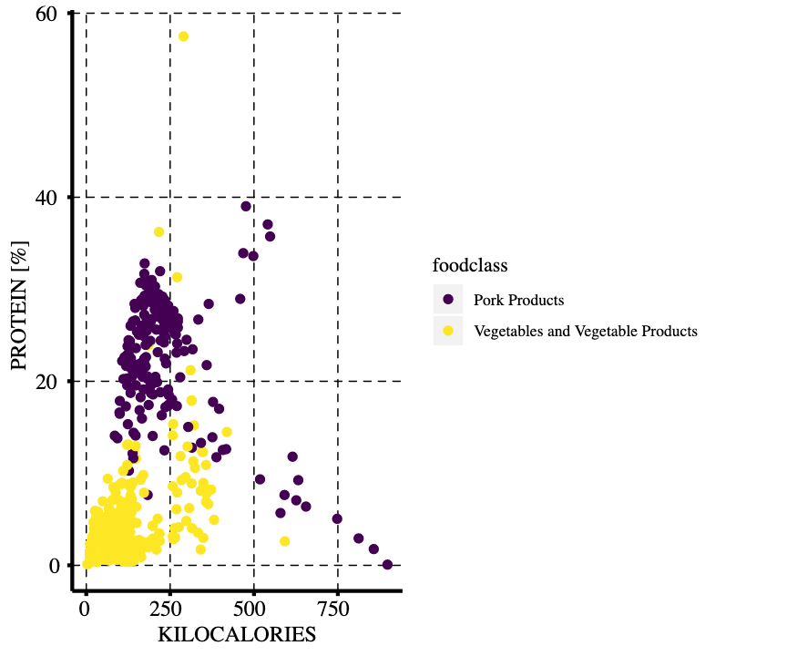
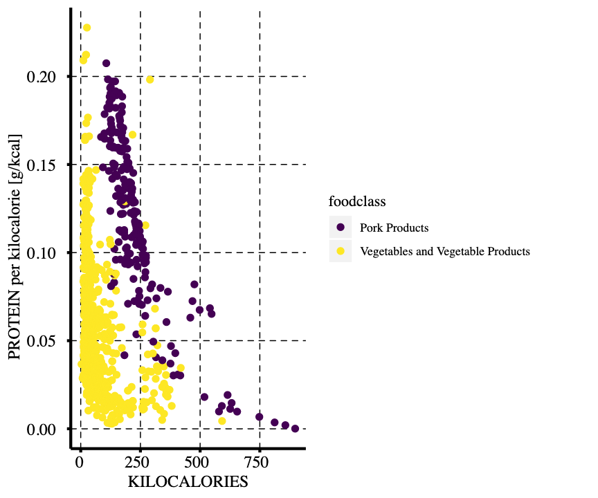

This project is more of general purpose. To me as an active gym-goer and runner, a 'healthy' nutrition is a priority.
In this example, I used data on nutrition from the [Goverment of Canada](https://www.canada.ca/en/health-canada/services/food-nutrition.html) to create an interactive app that explores food contents in relation to energy content. Often nutritional values are given relative to 100 g or even to an arbitrary serving size of the food. This information makes it difficult to understand how much of a given nutrient would be taken up, if a certain food is consumed until a desired level of energy consumption is reached.

For example, pork products generally contain much more protein than vegetables per weight (Figure 1). But because a lot of the weight of vegetables is water and fiber, they also contain less kilocalories.  

To adjust for this effect, I also plotted the protein content per kilocalorie. For example 100g of raw pork leg contain more kilocalories and more proteins than 100g of kidney beans. However, the amount of protein per kilocalorie (0.15 g) is almost the same and simlarly other vegetables have similarly high contents of proteins in relation to energy content (Figure 2).

This [app](https://athiemicke.shinyapps.io/nutrition2/) allows to vizualize the content of certain nutrients of different food classes over the kilokalories per 100g.

Other nutrients of particular interest are fiber, methionine, glycine, cystine and sodium. Altering the composition of amino acids in diet is a new approach in comabting aging and possibly age-associated diseaes. For example [methionine](https://www.nature.com/articles/s41586-019-1437-3) has been shown to affect cancer therapy and [cysteine](https://www.ncbi.nlm.nih.gov/pmc/articles/PMC5005830/) is known to be critical in the synthesis of glutathione and therefore in the protection to oxidative stress.